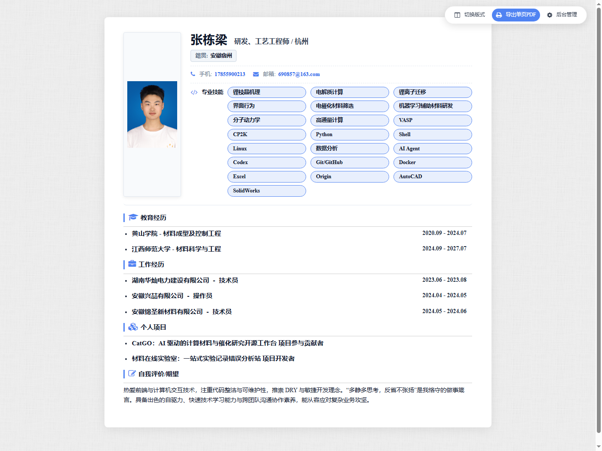
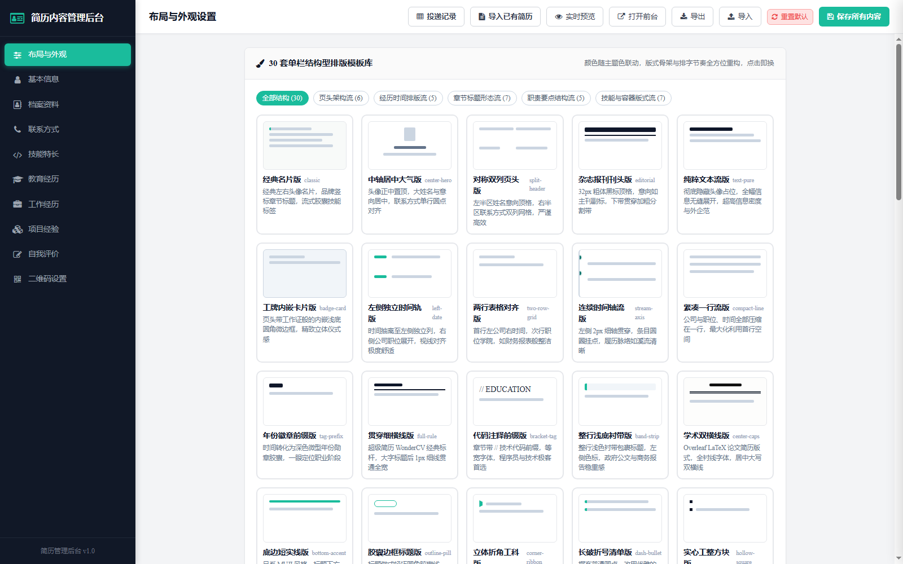
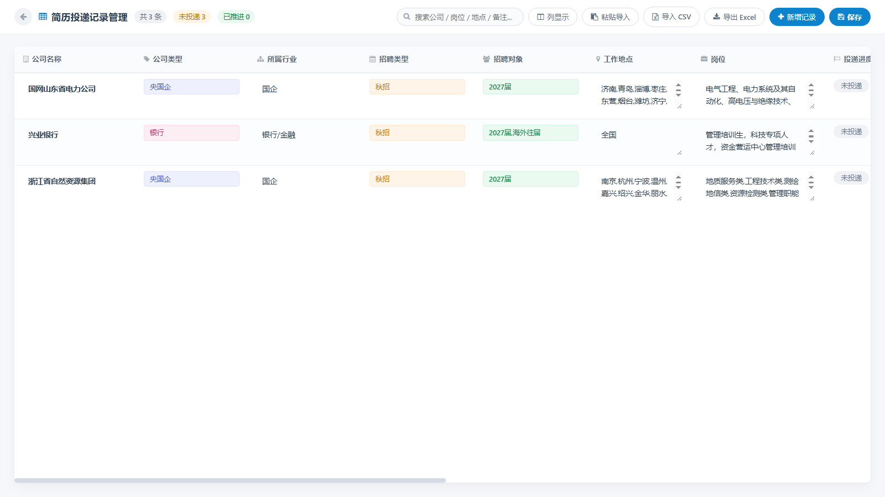

<div align="center">

# 智慧简历 · 个人简历展示与投递管理系统

**一个可以「可视化编辑 + 多模板换装 + 求职进度跟踪」的全栈简历项目**

[](https://github.com/XCai-0213/resume/stargazers)
[](https://github.com/XCai-0213/resume/network)
[](LICENSE)
[](https://nodejs.org/)
[](package.json)

[在线预览](https://my-resume-eddjokk5.edgeone.cool/) · [功能特性](#-核心特性) · [快速开始](#-快速开始) · [部署指南](#-部署到线上) · [投递记录](#-投递记录管理)

</div>

---

## 📖 项目简介

这不是一个静态的简历模板，而是一套**完整的简历管理系统**：

- 🎨 **后台可视化编辑** — 所有内容在网页后台填写，**无需碰任何代码**
- 🖼️ **30 套结构型模板** — 一键换装，颜色跟随主题色自动联动
- 📊 **投递记录管理** — 像管理表格一样跟踪每一份简历投递进度
- 📄 **简历智能导入** — 上传已有 PDF/Word 简历，自动解析填入系统
- 🚀 **双模式运行** — 本地服务器（数据写回文件）/ 纯静态托管（零成本发布）

> 基于开源简历模板 [itsay/resume](https://gitee.com/itsay/resume) 深度重构，感谢原作者。

---

## ✨ 核心特性

### 🎨 可视化后台，告别手写 HTML

传统简历模板改内容要开编辑器改 `index.html`，本项目提供完整的后台管理面板：

| 模块 | 可编辑内容 |
|------|-----------|
| **基本信息** | 姓名、求职意向、头像（本地上传/URL）、个性签名 |
| **档案资料** | 性别年龄、英语水平、政治面貌等任意键值对，可拖拽排序 |
| **联系方式** | 手机/邮箱/主页/GitHub/微信，支持一键拨号与跳转 |
| **专业技能** | 技能名称 + 熟练度 + **官方品牌彩色 Logo**（内置 80+ 图标库） |
| **教育经历** | 学校 · 学院 · 专业 · 时间 · 荣誉（支持可视化高亮重点） |
| **工作经历** | 公司 · 职位 · 时间 · 职责要点（自动解析成条目） |
| **项目经验** | 项目名 · Demo 链接 · 技术栈 · 目标 · 团队 · 贡献 · 成果 |
| **自我评价** | 多行文本，保留换行与段落 |
| **二维码** | 微信/作品集二维码上传 + 说明文字 |

### 🖼️ 30 套结构型模板

不是简单的换色，而是**版式骨架的真正重构**，按流派分为 5 类：

| 流派 | 模板 |
|------|------|
| **页头架构流**（6） | 经典名片、中轴居中大气、对称双列页头、杂志报刊刊头、纯粹文本流、工牌内嵌卡片 |
| **经历时间流**（5） | 左侧独立时间轨、两行表格对齐、连续时间轴流、紧凑一行流、年份徽章前缀 |
| **章节标题流**（7） | 贯穿细横线、代码注释前缀、整行浅底衬带、学术双横线、底边短实线、胶囊边框、立体折角 |
| **职责要点流**（5） | 长破折号、实心工整方块、行动导向箭头、悬挂缩进、紧密连贯段落 |
| **技能与容器流**（7） | 技能双列网格、极简无框平铺、高反差深底徽章、纯白无界、全封闭画框、从容大格局、极致高密单页 |

> 💡 **颜色由主题色统一控制**：选蓝色则全部模板变蓝，选墨绿则全变墨绿，模板只决定版式结构。

### 📊 投递记录管理

对标招聘网站的投递管理表，**15 个可配置字段**：

```
公司名称 · 公司类型 · 所属行业 · 招聘类型 · 招聘对象 · 工作地点 · 岗位
投递进度 · 更新时间 · 投递截止 · 相关链接 · 招聘公告 · 笔试情况 · 公司规模 · 备注
```

**功能亮点**：
- ✅ **列显示开关** — 按需勾选/隐藏任意列
- ✅ **状态跟踪** — 未投递 / 已投递 / 笔试中 / 面试中 / 已 offer / 已拒绝 / 已放弃
- ✅ **粘贴导入** — 从任意招聘网站框选复制，一键结构化入库
- ✅ **CSV/Excel 互导** — 支持导入 CSV、导出带 BOM 的 Excel（中文不乱码）
- ✅ **行内编辑** — 单元格直接改，`Ctrl+S` 保存，60 秒自动保存
- ✅ **搜索过滤** — 全字段实时搜索

### 📄 简历智能导入

上传已有简历文件，**自动识别并填入后台**：

- 支持格式：**PDF** / **Word (.docx)** / **Markdown** / **HTML** / **纯文本**
- 解析内容：姓名、电话、邮箱、GitHub、主页、求职意向、档案标签、教育经历（含学院/专业/时间）、工作经历（含职责要点）、项目经验（含目标/团队/贡献/成果）、技能、自我评价
- **纯前端解析**（pdf.js + mammoth.js 已本地化），文件不上传任何第三方
- 支持**追加**或**替换**模式，导入前可逐模块勾选

### 🚀 双运行模式

同一套代码，自动识别环境：

| 模式 | 启动方式 | 数据存储 | 适用场景 |
|------|----------|----------|----------|
| **本地服务器** | `npm start` | 写回 `data/resume.json` | 日常编辑内容 |
| **纯静态托管** | `npm run build:static` | 浏览器 localStorage + 导出 JSON | 免费上线发布 |

---

## 🖼️ 界面预览

### 前台简历

| 经典名片版 | 中轴居中版 | 左侧时间轨版 |
|:---:|:---:|:---:|
|  |  |  |

### 后台管理

| 布局与模板 | 投递记录管理 |
|:---:|:---:|
|  |  |

---

## 🚀 快速开始

### 环境要求

- **Node.js** ≥ 18（[下载](https://nodejs.org/)）
- 现代浏览器（Chrome / Edge / Firefox / Safari）

### 安装与启动

```bash
# 1. 克隆仓库
git clone https://github.com/XCai-0213/resume.git
cd resume

# 2. 启动本地服务（无需 npm install，零依赖！）
npm start
# 或双击 start.bat
```

启动后访问：

| 页面 | 地址 |
|------|------|
| 📄 前台简历 | http://localhost:8080 |
| ⚙️ 后台管理 | http://localhost:8080/admin/ |
| 📊 投递记录 | http://localhost:8080/admin/jobs.html |

### 使用流程

```
1. 打开后台 → 填写/导入简历内容
2. 选模板 → 挑一套喜欢的版式
3. 调主题色 → 换成你的品牌色
4. 点保存 → 前台立即生效
5. 导出 PDF → 用浏览器打印功能（已适配 A4 单页）
```

---

## 🌐 部署到线上

### 方式一：腾讯云 EdgeOne（推荐，免费）

```bash
# 1. 构建静态包
npm run build:static

# 2. 一键部署（需要 API Token，见文末）
deploy-edgeone.bat
```

或使用 CLI：

```bash
edgeone makers deploy ./dist -n my-resume -t <你的API_TOKEN>
```

**获取 API Token**：EdgeOne Makers 控制台 → API Token → 创建

### 方式二：其他静态托管

构建 `dist/` 后，把**里面的文件**上传到任意静态托管：

| 平台 | 方式 |
|------|------|
| 阿里云 OSS | 开启静态网站托管，上传全部文件 |
| 腾讯云 COS | 同上 |
| GitHub Pages | `gh-pages` 分支或 `/docs` 目录 |
| Vercel / Netlify | 直接拖拽 `dist` 目录 |
| Cloudflare Pages | 创建项目后上传 |

### 方式三：自定义域名

EdgeOne 支持绑定自有域名（如 `resume.example.com`）：

1. 控制台 → 域名管理 → 添加自定义域名
2. 在域名服务商添加 CNAME 记录
3. 开启 HTTPS（可申请免费证书）

> ⚠️ 若加速区域选择「中国大陆」，域名需完成 **ICP 备案**；选「全球可用区（不含中国大陆）」则无需备案。

### 静态模式下的数据更新

静态托管无服务器，数据存在浏览器 localStorage。要让**其他人**看到你的修改：

```
后台编辑 → 点「导出」下载 data.json → 替换站点里的 data.json → 重新部署
```

---

## 📁 项目结构

```
resume/
├── index.html                  # 前台简历页面
├── admin/                      # 后台管理
│   ├── index.html              #   后台主界面
│   ├── admin.js                #   表单逻辑、模板切换、图标库
│   ├── admin.css               #   后台样式
│   ├── jobs.html               #   投递记录页
│   ├── jobs.js                 #   投递记录逻辑
│   ├── jobs.css                #   投递记录样式（Hexo 风格）
│   ├── static-adapter.js       #   ⭐ 静态/服务器双模式适配层
│   └── libs/                   #   pdf.js + mammoth.js（简历解析）
├── assets/                     # 前台资源
│   ├── css/
│   │   ├── index.css           #   基础样式
│   │   ├── custom-layout.css   #   布局、字体、打印样式
│   │   └── templates.css       #   ⭐ 30 套模板样式
│   └── js/resume-app.js        #   前台渲染引擎
├── data/                       # 数据
│   ├── resume.json             #   简历数据
│   ├── default-resume.json     #   默认数据（重置用）
│   └── applications.json       #   投递记录数据
├── uploads/                    # 上传的图片
├── server.js                   # 本地服务器（零依赖）
├── build-static.js             # ⭐ 静态构建脚本
├── deploy-edgeone.bat          # ⭐ 一键部署脚本
└── package.json
```

---

## 🔌 API 接口

本地服务器提供以下接口（静态模式下由 `static-adapter.js` 自动接管）：

| 方法 | 路径 | 说明 |
|------|------|------|
| GET | `/api/resume` | 获取简历数据 |
| POST | `/api/resume` | 保存简历数据 |
| POST | `/api/reset` | 重置为默认数据 |
| POST | `/api/upload` | 上传图片（Base64） |
| GET | `/api/export` | 导出简历 JSON |
| GET | `/api/jobs` | 获取投递记录 |
| POST | `/api/jobs` | 保存投递记录 |
| POST | `/api/jobs/parse` | 文本解析（粘贴导入） |
| GET | `/api/jobs/export` | 导出 CSV |

---

## 🛠️ 技术栈

| 层面 | 技术 |
|------|------|
| **前端** | 原生 JavaScript（无框架）、CSS3、Font Awesome |
| **后端** | Node.js 原生 `http` 模块（**零第三方依赖**） |
| **文档解析** | pdf.js（PDF）、mammoth.js（Word） |
| **数据存储** | JSON 文件（服务器）/ localStorage（静态） |
| **部署** | EdgeOne Makers / 任意静态托管 |

---

## ❓ 常见问题

<details>
<summary><b>Q: 为什么没有用 Vue/React？</b></summary>

项目定位是「开箱即用、零构建、零依赖」。原生实现让用户 `git clone` 后直接 `npm start` 就能跑，不需要 `npm install` 装几百个包，也不需要理解构建工具链。对于一个简历项目，这是最合适的选择。
</details>

<details>
<summary><b>Q: 静态部署后，别人能看到我的后台吗？</b></summary>

能看到后台**界面**，但改不了你的内容——因为静态模式下所有编辑只保存在**访问者自己的浏览器**里。你的线上数据是安全的。

如果不想让人看到后台，可以：
1. 只在本地用 `npm start` 编辑，静态站只放前台
2. 或用 EdgeOne 的访问认证功能给 `/admin` 加密码
</details>

<details>
<summary><b>Q: 上传的图片存在哪？</b></summary>

- 本地服务器模式：存在 `uploads/` 目录
- 静态模式：转为 Base64 内嵌（注意 localStorage 约 5MB 上限，建议大图用外部 URL）
</details>

<details>
<summary><b>Q: 怎么导出 PDF？</b></summary>

前台右上角点「导出单页PDF」，或直接 `Ctrl+P`。已适配 A4 单页排版，隐藏了所有无关元素。
</details>

---

## 📄 License

[MIT](LICENSE) © XCai-0213

原始模板来自 [itsay/resume](https://gitee.com/itsay/resume)，同样采用 MIT 协议。

---

<div align="center">

**如果这个项目对你有帮助，欢迎点个 ⭐ Star**

</div>
